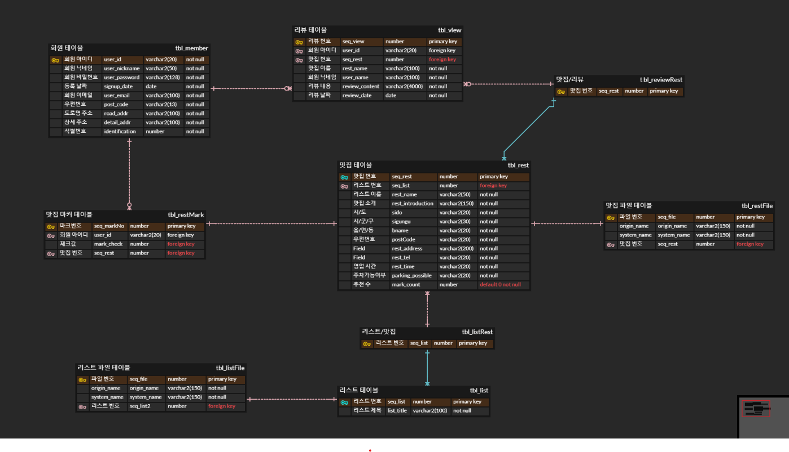

- - -

### 프로젝트 기간
#### 2021-12-01 ~ 2021-12-17

### 프로젝트 명
#### 맛집 플레이트(맛집 추천 커뮤니티) 🔥

### 프로젝트 인원
#### 3명👨‍👨‍👧‍👧

### 개발환경
+ Language : Java
+ DBMS : Oracle11g
+ Frontend : HTML, CSS, javascript, jsp/servlet
+ Library : Jquery, ojdbc, JSTL , Jackson , Bootstrap5
+ Server : Apache Tomcat 8.5
+ Control : GitHub
+ IDE : Eclipse IDE, SQL Developer, VS Code

- - -
### Use Case Diagram

- - -
### Entity-Relationship Diagram

